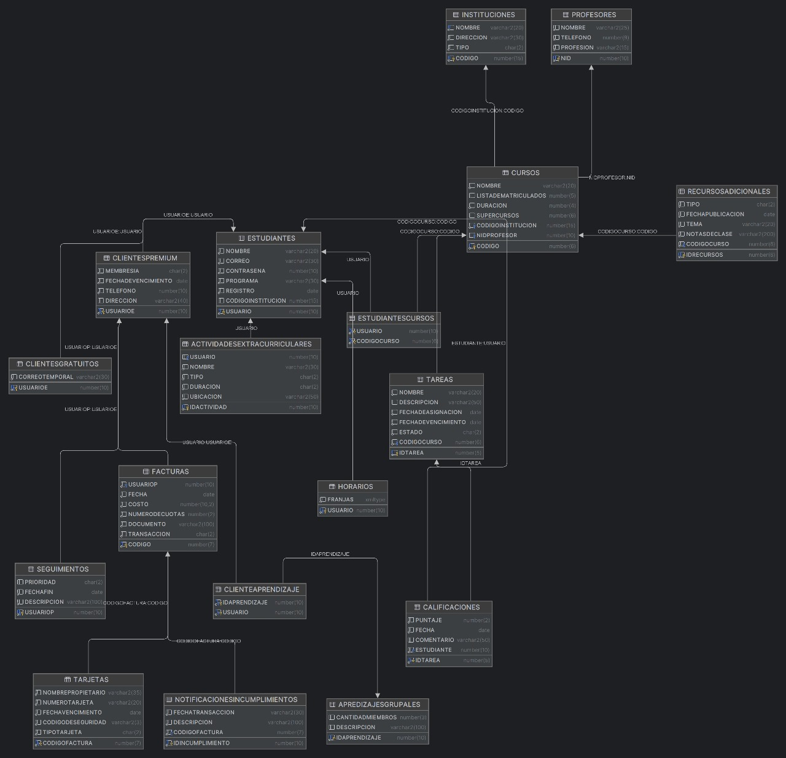

# 📚 TimeWise Student

> Sistema de gestión académica integral para optimizar el tiempo y la calidad de aprendizaje de los estudiantes.

---

## 👤 Autor

**Alison Geraldine Valderrama Munar**

---

## 📋 Descripción del Proyecto

**TimeWise Student** es una base de datos relacional diseñada para gestionar una organización estudiantil que prioriza la administración eficiente del tiempo y la calidad del aprendizaje de los estudiantes. El sistema permite:

- Gestión de estudiantes, instituciones y profesores
- Administración de cursos y recursos académicos
- Control de horarios y actividades extracurriculares
- Manejo de membresías (Premium y Gratuitas)
- Seguimiento de calificaciones y tareas
- Organización de aprendizajes grupales
- Sistema de recordatorios y seguimientos
- Gestión de facturación y pagos

---

## 🗄️ Modelo de Datos

### Entidades Principales

| Entidad | Descripción |
|---------|-------------|
| **Instituciones** | Escuelas (E) y Universidades (U) registradas en el sistema |
| **Estudiantes** | Usuarios del sistema con información personal y académica |
| **ClientesPremium** | Estudiantes con membresía pagada (P) o pendiente (PE) |
| **ClientesGratuitos** | Estudiantes con acceso gratuito mediante correo temporal (.edu) |
| **Cursos** | Cursos académicos con duración y capacidad de supercursos |
| **Profesores** | Docentes asignados a los cursos |
| **Tareas** | Asignaciones con estados: Pendiente (P), En progreso (E), Asignada (A) |
| **Calificaciones** | Puntajes y retroalimentación de tareas |
| **RecursosAdicionales** | Libros (L), Audio (A) y Video (V) para los cursos |
| **Horarios** | Franjas horarias almacenadas en formato XMLTYPE |
| **ActividadesExtracurriculares** | Actividades fuera del currículo académico |
| **AprendizajesGrupales** | Grupos de estudio colaborativo |
| **Seguimientos** | Monitoreo de progreso con prioridades |
| **Recordatorios** | Alertas y notificaciones para estudiantes premium |
| **Facturas** | Registro de transacciones y pagos |
| **Tarjetas** | Información de métodos de pago |

### Modelo Conceptual



---

## 📁 Estructura del Proyecto

El proyecto está organizado en **dos ciclos de desarrollo**, cada uno con módulos específicos:

### 🔄 CICLO 1

```
CICLO 1/
├── 1EstructuraDeclarativa/     # Definición de tablas y restricciones
│   ├── Tablas.sql              # Creación de 18 tablas principales
│   ├── Atributos.sql           # Constraints CHECK, PK, FK y UNIQUE
│   ├── Consultas.sql           # Consultas de análisis de datos
│   ├── Poblar.sql              # Datos de prueba iniciales
│   └── xTablas.sql             # Script de eliminación de tablas
│
├── 2RestriccionesProcedimentalesAutomatizacion/
│   ├── Disparadores.sql        # Triggers para lógica de negocio
│   ├── Acciones2.sql           # Procedimientos adicionales
│   ├── Tuplas2.sql             # Validaciones a nivel de tupla
│   └── xDisparadores.sql       # Script de eliminación de triggers
│
├── 3IndicesyVistas/
│   ├── Indices.sql             # Índices para optimización
│   └── Vistas.sql              # Vistas para consultas frecuentes
│
├── 4Componentes/
│   ├── CRUDE.sql               # CRUD con manejo de excepciones
│   ├── CRUDI.sql               # CRUD inicial
│   ├── CRUDOK.sql              # Pruebas de operaciones exitosas
│   ├── CRUDNoOK.sql            # Pruebas de operaciones fallidas
│   └── XCRUD.sql               # Script de eliminación de paquetes
│
├── 5Seguridad/
│   ├── Seguridad.sql           # Roles y permisos
│   ├── ActoresE.sql            # Configuración de actores externos
│   ├── ActoresI.sql            # Configuración de actores internos
│   └── ActoresOk.sql           # Validación de actores
│
└── 6Pruebas/
    └── Pruebas.sql             # Scripts de pruebas integrales
```

### 🔄 CICLO 2

```
CICLO2/
├── 1Estructura Declavariva/    # Extensión del modelo de datos
├── 2RestriccionesProcedimentales/
├── 3IndicesyVistas/
├── 4Componentes/
├── 5Seguridad/
└── Pruebas/
```

---

## ⚡ Funcionalidades Clave

### 🔒 Triggers Implementados

| Trigger | Descripción |
|---------|-------------|
| `TR_CALIFICACIONES_BU` | Impide modificar fecha y estudiante en calificaciones |
| `TR_PROFESORNOMBRE_BI` | Asigna "Personal" si el nombre del profesor es NULL |
| `TR_TAREA_CALIFICACION_BD` | Previene eliminar tareas con calificaciones asignadas |
| `TR_CALIFICACIONFECHA_BI` | Asigna fecha automática (SYSDATE) a calificaciones |
| `TR_CLIENTEEstado_BU` | Bloquea actualizaciones si membresía está pendiente |
| `TR_ESTUDIANTEMatricula_AI` | Actualiza automáticamente lista de matriculados |
| `TR_CLIENTEGratuito_BD` | Impide eliminar clientes gratuitos |

### 👁️ Vistas Disponibles

- **INFOESTUDIANTES**: Estudiantes sin recursos adicionales asignados
- **VistaEstudiantesInstituciones**: Información combinada de estudiantes e instituciones
- **VistaEstudiantesCursos**: Estudiantes matriculados por curso
- **VistaClientesPremium**: Detalle de clientes con membresía pagada
- **VistaClientesGratuitos**: Detalle de clientes con acceso gratuito

### 🔐 Roles de Seguridad

| Rol | Permisos |
|-----|----------|
| **Jefe_Administrador** | Acceso completo a procedimientos administrativos |
| **Profesor** | CRUD en calificaciones, ejecución de paquete profesor |
| **Estudiante** | Lectura en calificaciones, cursos, profesores, recursos y tareas |

---

## 🛠️ Tecnologías

- **Motor de Base de Datos:** Oracle SQL
- **Lenguaje:** PL/SQL
- **Modelado:** Astah (TimeWiseStudent.asta)

---

## 🚀 Instalación

1. **Crear las tablas:**
   ```sql
   @CICLO 1/1EstructuraDeclarativa/Tablas.sql
   ```

2. **Aplicar restricciones:**
   ```sql
   @CICLO 1/1EstructuraDeclarativa/Atributos.sql
   ```

3. **Crear triggers:**
   ```sql
   @CICLO 1/2RestriccionesProcedimentalesAutomatizacion/Disparadores.sql
   ```

4. **Crear índices y vistas:**
   ```sql
   @CICLO 1/3IndicesyVistas/Indices.sql
   @CICLO 1/3IndicesyVistas/Vistas.sql
   ```

5. **Crear paquetes CRUD:**
   ```sql
   @CICLO 1/4Componentes/CRUDI.sql
   ```

6. **Configurar seguridad:**
   ```sql
   @CICLO 1/5Seguridad/Seguridad.sql
   ```

7. **Poblar datos de prueba:**
   ```sql
   @CICLO 1/1EstructuraDeclarativa/Poblar.sql
   ```

---

## 📊 Consultas de Ejemplo

### Top 5 estudiantes con mejor promedio
```sql
SELECT * FROM (
  SELECT e.usuario, e.nombre, AVG(c.puntaje) as Promedio
  FROM Estudiantes e
  JOIN calificaciones c ON e.usuario = c.estudiante
  GROUP BY e.usuario, e.nombre
  ORDER BY Promedio DESC
)
WHERE ROWNUM <= 5;
```

### Cursos más populares
```sql
SELECT c.nombre, COUNT(*) as NumEstudiantes
FROM Cursos c
JOIN EstudiantesCursos ec ON c.codigo = ec.codigoCurso
GROUP BY c.codigo, c.nombre
ORDER BY NumEstudiantes DESC;
```

### Clientes Premium próximos a vencer
```sql
SELECT * FROM ClientesPremium
WHERE fechaDeVencimiento < ADD_MONTHS(SYSDATE, -6);
```

---

## 🎓 Referencia Académica

Este proyecto fue desarrollado como **trabajo final** para la asignatura **Modelos y Bases de Datos** en la **Universidad Escuela Colombiana de Ingeniería Julio Garavito**.

---

## 📄 Licencia

Proyecto académico - Universidad Escuela Colombiana de Ingeniería Julio Garavito © 2024